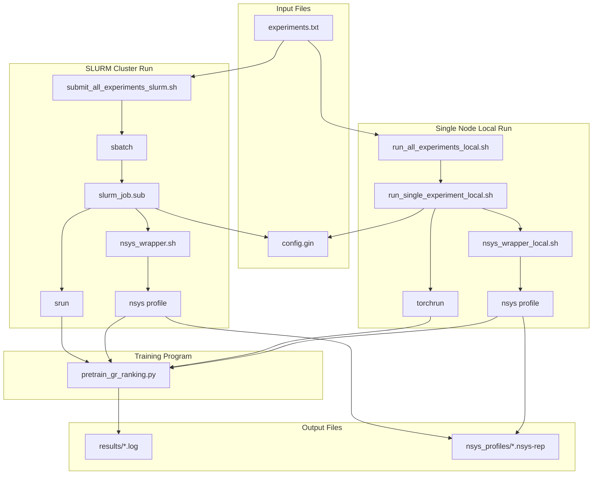

# HSTU Benchmark Scripts Usage Guide

This document provides detailed instructions for using HSTU Benchmark related scripts.

---

## Table of Contents

1. [Working Directory Requirements](#working-directory-requirements)
2. [File Structure](#file-structure)
3. [Script Dependencies](#script-dependencies)
4. [Experiment List File](#experiment-list-file)
5. [Single Node Local Execution](#single-node-local-execution)
6. [SLURM Cluster Submission](#slurm-cluster-submission)
7. [nsys Profile Sampling](#nsys-profile-sampling)
8. [Common Command Examples](#common-command-examples)
9. [Output File Description](#output-file-description)

---

## Working Directory Requirements

⚠️ **Important**: All scripts must be executed in the `recsys-examples/examples/hstu` directory!

```bash
# First switch to the correct working directory
cd /path/to/recsys-examples/examples/hstu

# Then execute scripts
./training/benchmark/run_single_experiment_local.sh ...
./training/benchmark/run_all_experiments_local.sh ...
./training/benchmark/submit_all_experiments_slurm.sh ...
```

---

## File Structure

```
examples/hstu/
├── training/
│   ├── benchmark/
│   │   ├── experiments.txt                    # Experiment list file
│   │   ├── run_single_experiment_local.sh     # Single node single experiment run script
│   │   ├── run_all_experiments_local.sh       # Single node batch run script
│   │   ├── submit_all_experiments_slurm.sh    # SLURM batch submission script
│   │   ├── slurm_job.sub                      # SLURM job script
│   │   └── results/                           # Output directory
│   │       ├── *.log                          # Training logs
│   │       └── nsys_profiles/                 # nsys sample files
│   ├── configs/                               # Configuration file directory
│   └── pretrain_gr_ranking.py                 # Training main program
```

---

## Script Dependencies

### Dependency Diagram



### Script Call Relationship Description

| Script | Caller | Called Scripts/Programs | Description |
|--------|--------|------------------------|-------------|
| `run_all_experiments_local.sh` | User | `run_single_experiment_local.sh` | Loops through experiment list, calls each one |
| `run_single_experiment_local.sh` | User/Parent Script | `torchrun` or `nsys_wrapper` | Single node distributed training launcher |
| `submit_all_experiments_slurm.sh` | User | `sbatch` → `slurm_job.sub` | Loop submits SLURM jobs |
| `slurm_job.sub` | SLURM Scheduler | `srun` or `nsys_wrapper` | Chooses execution method based on nsys enablement |
| `.nsys_wrapper.sh` | `slurm_job.sub` | `nsys profile` | Temporarily generated, independent sampling per rank |
| `.nsys_wrapper_local.sh` | `run_single_experiment_local.sh` | `nsys profile` | Temporarily generated, only specified ranks sample |

---

## nsys Profile Sampling

### Overview

All scripts (local and SLURM) support NVIDIA Nsight Systems (nsys) performance sampling for analyzing GPU/CUDA performance bottlenecks.

### nsys Parameter Description

When `--nsys` is enabled, the following fixed parameters are used (consistent between local and SLURM scripts):

| Parameter | Value | Description |
|-----------|-------|-------------|
| `-o` | `{output_path}` | Output file path (without extension) |
| `-f true` | - | Force overwrite existing files |
| `-s none` | - | No CPU sampling |
| `-t cuda,nvtx` | - | Trace CUDA API and NVTX markers |
| `-c cudaProfilerApi` | - | Use CUDA Profiler API to control sampling scope |
| `--cpuctxsw none` | - | No CPU context switch tracing |
| `--cuda-flush-interval 100` | - | CUDA event flush interval 100ms |
| `--capture-range-end=stop` | - | Stop when sampling range ends |
| `--cuda-graph-trace=node` | - | Trace CUDA Graph at node level |

### Local Script nsys Options

| Parameter | Description | Default |
|-----------|-------------|---------|
| `--nsys` | Enable nsys profile sampling | Disabled |
| `--nsys-ranks=LIST` | Specify which ranks to sample | `0` (rank 0 only) |

`--nsys-ranks` supported formats:
- `0` - Sample rank 0 only
- `0,1,2` - Sample multiple specified ranks
- `all` - Sample all ranks

### Examples

```bash
# Single node local run, sample rank 0 only
./training/benchmark/run_single_experiment_local.sh exp0_baseline \
    --config=training/configs/h100_16gpu_exp0_baseline.gin \
    --nsys

# Single node local run, sample rank 0 and 1
./training/benchmark/run_single_experiment_local.sh exp0_baseline \
    --config=training/configs/h100_16gpu_exp0_baseline.gin \
    --nsys --nsys-ranks=0,1

# Single node local run, sample all ranks
./training/benchmark/run_single_experiment_local.sh exp0_baseline \
    --config=training/configs/h100_16gpu_exp0_baseline.gin \
    --nsys --nsys-ranks=all

# Batch run all experiments, enable nsys
./training/benchmark/run_all_experiments_local.sh \
    --exp-file=training/benchmark/experiments.txt \
    --nsys

# Batch run all experiments, sample multiple ranks
./training/benchmark/run_all_experiments_local.sh \
    --exp-file=training/benchmark/experiments.txt \
    --nsys --nsys-ranks=0,1
```

---

## Experiment List File

### Format Description

The experiment list file (`experiments.txt`) is in CSV format with two columns:

```
exp_name,config_file_path
```

- `exp_name`: Experiment name, used for log and output file naming
- `config_file_path`: Configuration file relative path (**relative to `examples/hstu` directory**)

### Example Content

```
# HSTU Benchmark Experiment List
# Format: exp_name,config_file_path
# Comment lines start with #
#
# Important: Paths are relative to examples/hstu directory

exp0_baseline,training/configs/h100_16gpu_exp0_baseline.gin
exp1_cutlass,training/configs/h100_16gpu_exp1_cutlass.gin
exp2_fusion,training/configs/h100_16gpu_exp2_fusion.gin
exp3_recompute,training/configs/h100_16gpu_exp3_recompute.gin
exp4_dynamicemb,training/configs/h100_16gpu_exp4_dynamicemb.gin
exp5_lfu,training/configs/h100_16gpu_exp5_lfu.gin
exp6_pipeline,training/configs/h100_16gpu_exp6_pipeline.gin
exp7_tp,training/configs/h100_16gpu_exp7_tp.gin
exp8_full,training/configs/h100_16gpu_exp8_full.gin
```

### Custom Experiment List

You can create a custom experiment list file to run only some experiments:

```bash
# Create in examples/hstu directory
cat > my_experiments.txt << EOF
# My custom experiments
exp0_baseline,training/configs/h100_16gpu_exp0_baseline.gin
exp8_full,training/configs/h100_16gpu_exp8_full.gin
EOF
```

---

## Single Node Local Execution

### run_single_experiment_local.sh

Run a single experiment (single node multi-GPU).

#### Usage

```bash
# Must execute in examples/hstu directory
cd /path/to/recsys-examples/examples/hstu
./training/benchmark/run_single_experiment_local.sh <exp_name> --config=<config_file> [options]
```

#### Parameters

| Parameter | Description | Required | Default |
|-----------|-------------|----------|---------|
| `exp_name` | Experiment name | ✅ | - |
| `--config=PATH` | Configuration file path (relative to examples/hstu) | ✅ | - |
| `--nproc=N` | Number of processes/GPUs | ❌ | 8 |
| `--nsys` | Enable nsys profile sampling | ❌ | Disabled |
| `--nsys-ranks=LIST` | Specify sampling ranks | ❌ | 0 |
| `--help` | Show help | ❌ | - |

#### Examples

```bash
# First switch to correct directory
cd /path/to/recsys-examples/examples/hstu

# Basic usage
./training/benchmark/run_single_experiment_local.sh exp0_baseline \
    --config=training/configs/h100_16gpu_exp0_baseline.gin

# Specify GPU count
./training/benchmark/run_single_experiment_local.sh exp0_baseline \
    --config=training/configs/h100_16gpu_exp0_baseline.gin \
    --nproc=4

# Enable nsys profile (rank 0 only)
./training/benchmark/run_single_experiment_local.sh exp0_baseline \
    --config=training/configs/h100_16gpu_exp0_baseline.gin \
    --nsys

# Enable nsys profile (sample rank 0 and 1)
./training/benchmark/run_single_experiment_local.sh exp0_baseline \
    --config=training/configs/h100_16gpu_exp0_baseline.gin \
    --nsys --nsys-ranks=0,1

# Use absolute path
./training/benchmark/run_single_experiment_local.sh my_exp \
    --config=/path/to/my_config.gin \
    --nproc=8
```

---

### run_all_experiments_local.sh

Batch run experiments from experiment list file (single node multi-GPU).

#### Usage

```bash
# Must execute in examples/hstu directory
cd /path/to/recsys-examples/examples/hstu
./training/benchmark/run_all_experiments_local.sh --exp-file=<file> [options]
```

#### Parameters

| Parameter | Description | Required | Default |
|-----------|-------------|----------|---------|
| `--exp-file=FILE` | Experiment list file (relative to examples/hstu) | ✅ | - |
| `--nproc=N` | Number of processes/GPUs | ❌ | 8 |
| `--nsys` | Enable nsys profile sampling | ❌ | Disabled |
| `--nsys-ranks=LIST` | Specify sampling ranks | ❌ | 0 |
| `--help` | Show help | ❌ | - |

#### Examples

```bash
# First switch to correct directory
cd /path/to/recsys-examples/examples/hstu

# Run all experiments
./training/benchmark/run_all_experiments_local.sh --exp-file=training/benchmark/experiments.txt

# Specify GPU count
./training/benchmark/run_all_experiments_local.sh --exp-file=training/benchmark/experiments.txt --nproc=4

# Enable nsys profile (all experiments sample rank 0)
./training/benchmark/run_all_experiments_local.sh --exp-file=training/benchmark/experiments.txt --nsys

# Enable nsys profile (sample multiple ranks)
./training/benchmark/run_all_experiments_local.sh --exp-file=training/benchmark/experiments.txt \
    --nsys --nsys-ranks=0,1

# Use custom experiment list
./training/benchmark/run_all_experiments_local.sh --exp-file=my_experiments.txt --nproc=8 --nsys
```

---

## SLURM Cluster Submission

### submit_all_experiments_slurm.sh

Batch submit experiment jobs using SLURM sbatch.

#### Usage

```bash
# Must execute in examples/hstu directory
cd /path/to/recsys-examples/examples/hstu
./training/benchmark/submit_all_experiments_slurm.sh --exp-file=<file> [options]
```

#### Parameters

| Parameter | Description | Required | Default |
|-----------|-------------|----------|---------|
| `--exp-file=FILE` | Experiment list file (relative to examples/hstu) | ✅ | - |
| `--nsys` | Enable nsys profile sampling | ❌ | Disabled |
| `--sequential` | Sequential execution (job dependency) | ❌ | Parallel |
| `--partition=NAME` | SLURM partition name | ❌ | gpu |
| `--nodes=N` | Number of nodes | ❌ | 2 |
| `--ranks-per-node=N` | Ranks per node | ❌ | 8 |
| `--gpus-per-node=N` | GPUs per node | ❌ | 8 |
| `--time=HH:MM:SS` | Job time limit | ❌ | 04:00:00 |
| `--dry-run` | Print commands only, don't submit | ❌ | - |
| `--help` | Show help | ❌ | - |

#### Examples

```bash
# First switch to correct directory
cd /path/to/recsys-examples/examples/hstu

# Submit all experiments (default configuration)
./training/benchmark/submit_all_experiments_slurm.sh --exp-file=training/benchmark/experiments.txt

# Enable nsys profile
./training/benchmark/submit_all_experiments_slurm.sh --exp-file=training/benchmark/experiments.txt --nsys

# Sequential execution + nsys
./training/benchmark/submit_all_experiments_slurm.sh --exp-file=training/benchmark/experiments.txt --nsys --sequential

# Custom cluster configuration
./training/benchmark/submit_all_experiments_slurm.sh --exp-file=training/benchmark/experiments.txt \
    --nodes=4 \
    --ranks-per-node=8 \
    --gpus-per-node=8 \
    --partition=h100 \
    --time=08:00:00 \
    --nsys

# Test mode (don't actually submit)
./training/benchmark/submit_all_experiments_slurm.sh --exp-file=training/benchmark/experiments.txt --nsys --dry-run

# Use custom experiment list
./training/benchmark/submit_all_experiments_slurm.sh --exp-file=my_experiments.txt --nsys
```

---

### slurm_job.sub

SLURM job script that can be called automatically by `submit_all_experiments_slurm.sh` or used standalone.

#### Environment Variables

The script receives parameters through the following environment variables:

| Variable | Description | Required | Default |
|----------|-------------|----------|---------|
| `HSTU_ROOT` | Absolute path to `examples/hstu` directory | ✅ | - |
| `EXP_NAME` | Experiment name | ❌ | `exp0_baseline` |
| `CONFIG_FILE` | Configuration file path (relative to `examples/hstu` or absolute) | ✅ | - |
| `EXP_OUTPUT_DIR` | Output directory for logs and nsys profiles | ✅ | - |
| `ENABLE_NSYS` | Enable nsys profiling (0/1) | ❌ | `0` |

#### Standalone Usage

You can use `slurm_job.sub` directly with `sbatch` without going through `submit_all_experiments_slurm.sh`:

```bash
# Basic usage - submit a single experiment
sbatch \
    --export=HSTU_ROOT=/path/to/recsys-examples/examples/hstu,EXP_NAME=exp0_baseline,CONFIG_FILE=training/benchmark/gin_configs/benchmark_exp0_baseline.gin,EXP_OUTPUT_DIR=/path/to/output \
    /path/to/recsys-examples/examples/hstu/training/benchmark/slurm_job.sub

# With nsys profiling enabled
sbatch \
    --export=HSTU_ROOT=/path/to/recsys-examples/examples/hstu,EXP_NAME=exp0_baseline,CONFIG_FILE=training/benchmark/gin_configs/benchmark_exp0_baseline.gin,EXP_OUTPUT_DIR=/path/to/output,ENABLE_NSYS=1 \
    /path/to/recsys-examples/examples/hstu/training/benchmark/slurm_job.sub

# Override SLURM parameters (nodes, partition, time limit, etc.)
sbatch \
    --nodes=4 \
    --partition=h100 \
    --time=08:00:00 \
    --job-name=my_custom_job \
    --export=HSTU_ROOT=/path/to/recsys-examples/examples/hstu,EXP_NAME=exp8_full,CONFIG_FILE=training/benchmark/gin_configs/benchmark_exp8_full.gin,EXP_OUTPUT_DIR=/path/to/output,ENABLE_NSYS=1 \
    /path/to/recsys-examples/examples/hstu/training/benchmark/slurm_job.sub

# Redirect stdout/stderr to custom files
sbatch \
    --output=/path/to/output/my_job_%j.out \
    --export=HSTU_ROOT=/path/to/recsys-examples/examples/hstu,EXP_NAME=exp0_baseline,CONFIG_FILE=training/benchmark/gin_configs/benchmark_exp0_baseline.gin,EXP_OUTPUT_DIR=/path/to/output \
    /path/to/recsys-examples/examples/hstu/training/benchmark/slurm_job.sub
```

#### Default SLURM Resource Configuration

The script has the following default SLURM resource settings (can be overridden via `sbatch` command line):

| Parameter | Default Value | Description |
|-----------|---------------|-------------|
| `--nodes` | 2 | Number of nodes |
| `--ntasks-per-node` | 8 | Tasks (ranks) per node |
| `--cpus-per-task` | 8 | CPUs per task |
| `--time` | 04:00:00 | Time limit |
| `--mem` | 0 | Use all available memory |
| `--exclusive` | - | Exclusive node access |
| `--container-image` | `gitlab-master.nvidia.com/devtech-compute/distributed-recommender:devel_latest` | Container image |
| `--container-mounts` | /lustre:/lustre | Mount host filesystem into container |
| `--output` | hstu-e2e-benchmark-%j.out | SLURM stdout/stderr file (%j = job ID) |

#### Output Structure

```
{EXP_OUTPUT_DIR}/
├── {exp_name}_{jobid}_{timestamp}.log           # Training log
└── {exp_name}_{timestamp}_job{jobid}_node{N}_rank{R}_{hostname}.nsys-rep  # nsys profiles (if enabled)
```

#### Practical Examples

```bash
# Example 1: Quick test with baseline config
sbatch \
    --nodes=1 \
    --time=01:00:00 \
    --export=HSTU_ROOT=$(pwd),EXP_NAME=test_baseline,CONFIG_FILE=training/benchmark/gin_configs/benchmark_exp0_baseline.gin,EXP_OUTPUT_DIR=$(pwd)/training/benchmark/results/test \
    training/benchmark/slurm_job.sub

# Example 2: Full optimization experiment with profiling
sbatch \
    --nodes=2 \
    --partition=gpu \
    --export=HSTU_ROOT=$(pwd),EXP_NAME=exp8_full,CONFIG_FILE=training/benchmark/gin_configs/benchmark_exp8_full.gin,EXP_OUTPUT_DIR=$(pwd)/training/benchmark/results/exp8,ENABLE_NSYS=1 \
    training/benchmark/slurm_job.sub

# Example 3: Using absolute paths
HSTU_ROOT=/home/user/recsys-examples/examples/hstu
OUTPUT_DIR=/scratch/user/benchmark_results
sbatch \
    --export=HSTU_ROOT=${HSTU_ROOT},EXP_NAME=exp2_fusion,CONFIG_FILE=training/benchmark/gin_configs/benchmark_exp2_fusion.gin,EXP_OUTPUT_DIR=${OUTPUT_DIR},ENABLE_NSYS=1 \
    ${HSTU_ROOT}/training/benchmark/slurm_job.sub
```

---

## Common Command Examples

**Note**: All commands must be executed in the `examples/hstu` directory!

```bash
# First switch to correct directory
cd /path/to/recsys-examples/examples/hstu
```

### Single Node Development Testing

```bash
# Quick test single experiment (1 GPU)
./training/benchmark/run_single_experiment_local.sh exp0_baseline \
    --config=training/configs/h100_16gpu_exp0_baseline.gin \
    --nproc=1

# 4 GPU test
./training/benchmark/run_single_experiment_local.sh exp0_baseline \
    --config=training/configs/h100_16gpu_exp0_baseline.gin \
    --nproc=4

# Enable nsys sampling test
./training/benchmark/run_single_experiment_local.sh exp0_baseline \
    --config=training/configs/h100_16gpu_exp0_baseline.gin \
    --nproc=4 --nsys
```

### Full Benchmark (Single Node)

```bash
# Run all experiments with 8 GPUs
./training/benchmark/run_all_experiments_local.sh \
    --exp-file=training/benchmark/experiments.txt \
    --nproc=8

# Run all experiments with 8 GPUs, enable nsys
./training/benchmark/run_all_experiments_local.sh \
    --exp-file=training/benchmark/experiments.txt \
    --nproc=8 --nsys
```

### SLURM Cluster Submission

```bash
# Dual node 16 GPUs, enable nsys
./training/benchmark/submit_all_experiments_slurm.sh \
    --exp-file=training/benchmark/experiments.txt \
    --nodes=2 \
    --ranks-per-node=8 \
    --nsys

# Sequential execution (run next after previous completes)
./training/benchmark/submit_all_experiments_slurm.sh \
    --exp-file=training/benchmark/experiments.txt \
    --nodes=2 \
    --ranks-per-node=8 \
    --nsys \
    --sequential

# View commands to be submitted (don't actually submit)
./training/benchmark/submit_all_experiments_slurm.sh \
    --exp-file=training/benchmark/experiments.txt \
    --nsys \
    --dry-run
```

### Run Only Some Experiments

```bash
# Create custom experiment list (in examples/hstu directory)
cat > quick_test.txt << EOF
exp0_baseline,training/configs/h100_16gpu_exp0_baseline.gin
exp8_full,training/configs/h100_16gpu_exp8_full.gin
EOF

# Local run
./training/benchmark/run_all_experiments_local.sh --exp-file=quick_test.txt --nproc=8

# Local run + nsys
./training/benchmark/run_all_experiments_local.sh --exp-file=quick_test.txt --nproc=8 --nsys

# Or submit to SLURM
./training/benchmark/submit_all_experiments_slurm.sh --exp-file=quick_test.txt --nsys
```

---

## Output File Description

### Log Files

All logs are saved in the `results/` directory, filenames include experiment name:

```
results/
├── {exp_name}_{timestamp}.log                    # Local run log
├── {exp_name}_{jobid}_{timestamp}.log            # SLURM job log
├── {exp_name}_{jobid}.out                        # SLURM stdout/stderr
└── submission_{timestamp}.log                    # Submission record
```

### nsys Profile Files

When nsys is enabled, profile files are saved in `results/nsys_profiles/`:

**Local run format:**
```
results/nsys_profiles/
└── {exp_name}_{timestamp}_rank{R}_{hostname}.nsys-rep
```

**SLURM run format:**
```
results/nsys_profiles/
└── {exp_name}_{timestamp}_job{jobid}_node{N}_rank{R}_{hostname}.nsys-rep
```

Filename format description:
- `exp_name`: Experiment name
- `timestamp`: Timestamp (YYYYMMDD_HHMMSS)
- `jobid`: SLURM job ID (SLURM only)
- `N`: Node number (0, 1, ...) (SLURM only)
- `R`: Rank number (local rank for local, global rank for SLURM)
- `hostname`: Hostname

### Analyzing nsys Files

```bash
# Command line statistics
nsys stats results/nsys_profiles/exp0_baseline_*.nsys-rep

# GUI analysis
nsys-ui results/nsys_profiles/exp0_baseline_*.nsys-rep

# Export to JSON
nsys export -o output.json results/nsys_profiles/exp0_baseline_*.nsys-rep
```

---

## SLURM Job Management

### Common Commands

```bash
# View job queue
squeue -u $USER

# View job details
scontrol show job <job_id>

# Cancel single job
scancel <job_id>

# Cancel all jobs
scancel -u $USER

# View job history
sacct -u $USER --starttime=today
```

---

## Troubleshooting

### Common Issues

1. **Experiment list file not found**
   ```
   ❌ Error: Experiment list file not found
   ```
   Solution: Check if `--exp-file` path is correct

2. **Configuration file not found**
   ```
   ❌ Error: Config file not found
   ```
   Solution: Check configuration file paths in experiments.txt

3. **Insufficient GPUs**
   Solution: Reduce `--nproc` or `--ranks-per-node` parameter

4. **Out of Memory (OOM)**
   Solution: Reduce batch size or enable recompute configuration

5. **nsys profile file empty or sampling range is 0**
   Solution: Ensure training code correctly uses `torch.cuda.cudart().cudaProfilerStart()` and `cudaProfilerStop()`

6. **nsys permission issue**
   Solution: Ensure permission to execute `nsys` command, may need root privileges or configure perf_event_paranoid

---

## Version Information

- **Document Version**: v1.1
- **Last Updated**: 2026-01-30
- **Applicable Script Version**: All benchmark scripts
- **Updates**: Added local script nsys profile support documentation
