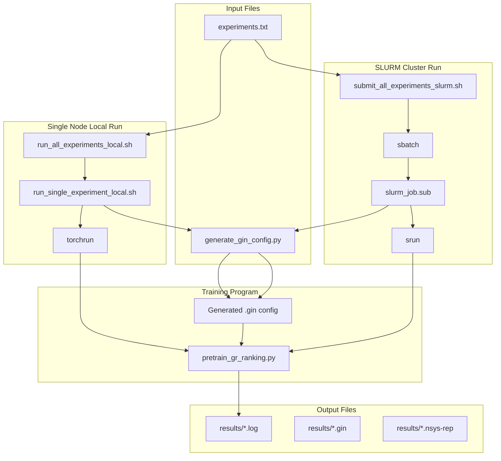

# HSTU Benchmark Scripts Usage Guide

This document provides detailed instructions for using HSTU Benchmark related scripts.

---

## Table of Contents

1. [Working Directory Requirements](#working-directory-requirements)
2. [File Structure](#file-structure)
3. [Script Dependencies](#script-dependencies)
4. [Optimization Switches](#optimization-switches)
5. [Experiment List File](#experiment-list-file)
6. [Single Node Local Execution](#single-node-local-execution)
7. [SLURM Cluster Submission](#slurm-cluster-submission)
8. [nsys Profile Sampling](#nsys-profile-sampling)
9. [Common Command Examples](#common-command-examples)
10. [Output File Description](#output-file-description)

---

## Working Directory Requirements

⚠️ **Important**: All scripts must be executed in the `recsys-examples/examples/hstu` directory!

```bash
# First switch to the correct working directory
cd /path/to/recsys-examples/examples/hstu

# Then execute scripts
./training/benchmark/run_single_experiment_local.sh ...
./training/benchmark/run_all_experiments_local.sh ...
./training/benchmark/submit_all_experiments_slurm.sh ...
```

---

## File Structure

```
examples/hstu/
├── training/
│   ├── benchmark/
│   │   ├── experiments.txt                    # Experiment list file
│   │   ├── generate_gin_config.py             # Gin config generator script
│   │   ├── run_single_experiment_local.sh     # Single node single experiment run script
│   │   ├── run_all_experiments_local.sh       # Single node batch run script
│   │   ├── submit_all_experiments_slurm.sh    # SLURM batch submission script
│   │   ├── slurm_job.sub                      # SLURM job script
│   │   └── results/                           # Output directory
│   │       └── {batch_timestamp}/
│   │           └── {exp_name}/
│   │               ├── {exp_name}_*.log       # Training logs
│   │               ├── {exp_name}_*.gin       # Generated config
│   │               └── *.nsys-rep             # nsys profiles (if enabled)
│   └── pretrain_gr_ranking.py                 # Training main program
```

---

## Script Dependencies

### Dependency Diagram



### Script Call Relationship Description

| Script | Caller | Called Scripts/Programs | Description |
|--------|--------|------------------------|-------------|
| `run_all_experiments_local.sh` | User | `run_single_experiment_local.sh` | Loops through experiment list, calls each one |
| `run_single_experiment_local.sh` | User/Parent Script | `generate_gin_config.py`, `torchrun` | Generates config, launches distributed training |
| `submit_all_experiments_slurm.sh` | User | `sbatch` → `slurm_job.sub` | Loop submits SLURM jobs |
| `slurm_job.sub` | SLURM Scheduler | `generate_gin_config.py`, `srun` | Generates config, runs training |
| `generate_gin_config.py` | All scripts | - | Generates gin config based on optimization switches |

---

## Optimization Switches

All scripts use the same set of optimization switches to configure experiments. These switches are passed to `generate_gin_config.py` to generate the appropriate gin config file.

### Available Switches

| Switch | Type | Default | Description |
|--------|------|---------|-------------|
| `--kernel_backend` | `triton`/`cutlass` | `triton` | Attention kernel backend |
| `--recompute_layernorm` | flag | `False` | Enable LayerNorm selective recompute |
| `--balanced_shuffler` | flag | `False` | Enable workload balancer for variable-length sequences |
| `--caching` | flag | `False` | Enable DynamicEmb GPU caching |
| `--ratio` | float | `0` | GPU cache ratio (0.0-1.0), auto-set to 0.1 if caching enabled |
| `--evict` | `lru`/`lfu` | `lru` | Cache eviction strategy |
| `--pipeline_type` | `none`/`prefetch` | `none` | Pipeline type for I/O hiding |
| `--tp_size` | int | `1` | Tensor Parallel size |

### Switch Combinations for Standard Experiments

| Experiment | Switches |
|------------|----------|
| exp0_baseline | *(all defaults)* |
| exp1_cutlass | `--kernel_backend cutlass` |
| exp2_recompute | `--kernel_backend cutlass --recompute_layernorm` |
| exp3_workload_balancer | `--kernel_backend cutlass --recompute_layernorm --balanced_shuffler` |
| exp4_dynamicemb_caching | `--kernel_backend cutlass --recompute_layernorm --balanced_shuffler --caching` |
| exp5_lfu | `--kernel_backend cutlass --recompute_layernorm --balanced_shuffler --caching --evict lfu` |
| exp6_pipeline | `--kernel_backend cutlass --recompute_layernorm --balanced_shuffler --caching --evict lfu --pipeline_type prefetch` |
| exp7_tp | `--kernel_backend cutlass --recompute_layernorm --balanced_shuffler --caching --evict lfu --pipeline_type prefetch --tp_size 2` |
| exp8_full | `--kernel_backend cutlass --recompute_layernorm --balanced_shuffler --caching --evict lfu --pipeline_type prefetch --tp_size 2` |

---

## Experiment List File

### Format Description

The experiment list file (`experiments.txt`) is in CSV format with two columns:

```
exp_name,gin_options
```

- `exp_name`: Experiment name, used for log and output file naming
- `gin_options`: Options passed to `generate_gin_config.py` (can be empty for baseline)

### Example Content

```
# HSTU Benchmark Experiment List
# Format: exp_name,generate_gin_config_options
# Comment lines start with #
#
# Available options:
#   --kernel_backend [triton|cutlass]   (default: triton)
#   --recompute_layernorm               (default: False)
#   --balanced_shuffler                 (default: False)
#   --caching                           (default: False)
#   --ratio FLOAT                       (default: 0, auto-set to 0.1 when caching enabled)
#   --evict [lru|lfu]                   (default: lru)
#   --pipeline_type [none|prefetch]     (default: none)
#   --tp_size INT                       (default: 1)

exp0_baseline,
exp1_cutlass,--kernel_backend cutlass
exp2_recompute,--kernel_backend cutlass --recompute_layernorm
exp3_workload_balancer,--kernel_backend cutlass --recompute_layernorm --balanced_shuffler
exp4_dynamicemb_caching,--kernel_backend cutlass --recompute_layernorm --balanced_shuffler --caching
exp5_lfu,--kernel_backend cutlass --recompute_layernorm --balanced_shuffler --caching --evict lfu
exp6_pipeline,--kernel_backend cutlass --recompute_layernorm --balanced_shuffler --caching --evict lfu --pipeline_type prefetch
exp7_tp,--kernel_backend cutlass --recompute_layernorm --balanced_shuffler --caching --evict lfu --pipeline_type prefetch --tp_size 2
exp8_full,--kernel_backend cutlass --recompute_layernorm --balanced_shuffler --caching --evict lfu --pipeline_type prefetch --tp_size 2
```

### Custom Experiment List

You can create a custom experiment list file to run only some experiments:

```bash
# Create in examples/hstu directory
cat > my_experiments.txt << EOF
# My custom experiments
exp0_baseline,
exp4_caching,--kernel_backend cutlass --recompute_layernorm --balanced_shuffler --caching
exp8_full,--kernel_backend cutlass --recompute_layernorm --balanced_shuffler --caching --evict lfu --pipeline_type prefetch --tp_size 2
EOF
```

---

## Single Node Local Execution

### run_single_experiment_local.sh

Run a single experiment (single node multi-GPU).

#### Usage

```bash
# Must execute in examples/hstu directory
cd /path/to/recsys-examples/examples/hstu
./training/benchmark/run_single_experiment_local.sh <exp_name> [optimization switches] [options]
```

#### Parameters

| Parameter | Description | Required | Default |
|-----------|-------------|----------|---------|
| `exp_name` | Experiment name | ✅ | - |
| `--kernel_backend` | Attention backend (triton/cutlass) | ❌ | triton |
| `--recompute_layernorm` | Enable LayerNorm recompute | ❌ | False |
| `--balanced_shuffler` | Enable workload balancer | ❌ | False |
| `--caching` | Enable DynamicEmb caching | ❌ | False |
| `--ratio` | GPU cache ratio | ❌ | 0 (auto 0.1 if caching) |
| `--evict` | Eviction strategy (lru/lfu) | ❌ | lru |
| `--pipeline_type` | Pipeline type (none/prefetch) | ❌ | none |
| `--tp_size` | Tensor Parallel size | ❌ | 1 |
| `--nproc=N` | Number of processes/GPUs | ❌ | 8 |
| `--output-dir=PATH` | Output directory | ❌ | results/{timestamp}/{exp_name}/ |
| `--nsys` | Enable nsys profile sampling | ❌ | Disabled |
| `--dry-run` | Print commands only, show generated config | ❌ | - |
| `--help` | Show help | ❌ | - |

#### Examples

```bash
# First switch to correct directory
cd /path/to/recsys-examples/examples/hstu

# Baseline (all defaults)
./training/benchmark/run_single_experiment_local.sh exp0_baseline

# CUTLASS attention
./training/benchmark/run_single_experiment_local.sh exp1_cutlass \
    --kernel_backend cutlass

# With recompute
./training/benchmark/run_single_experiment_local.sh exp2_recompute \
    --kernel_backend cutlass --recompute_layernorm

# Full optimization
./training/benchmark/run_single_experiment_local.sh exp8_full \
    --kernel_backend cutlass --recompute_layernorm --balanced_shuffler \
    --caching --evict lfu --pipeline_type prefetch --tp_size 2

# Specify GPU count
./training/benchmark/run_single_experiment_local.sh exp0_baseline --nproc=4

# Enable nsys profile
./training/benchmark/run_single_experiment_local.sh exp0_baseline --nsys

# Dry run (show generated config without running)
./training/benchmark/run_single_experiment_local.sh exp4_caching \
    --kernel_backend cutlass --recompute_layernorm --balanced_shuffler --caching \
    --dry-run
```

---

### run_all_experiments_local.sh

Batch run experiments from experiment list file (single node multi-GPU).

#### Usage

```bash
# Must execute in examples/hstu directory
cd /path/to/recsys-examples/examples/hstu
./training/benchmark/run_all_experiments_local.sh --exp-file=<file> [options]
```

#### Parameters

| Parameter | Description | Required | Default |
|-----------|-------------|----------|---------|
| `--exp-file=FILE` | Experiment list file (relative to examples/hstu) | ✅ | - |
| `--nproc=N` | Number of processes/GPUs | ❌ | 8 |
| `--results-dir=PATH` | Output directory | ❌ | training/benchmark/results |
| `--nsys` | Enable nsys profile sampling | ❌ | Disabled |
| `--dry-run` | Print commands only | ❌ | - |
| `--help` | Show help | ❌ | - |

#### Examples

```bash
# First switch to correct directory
cd /path/to/recsys-examples/examples/hstu

# Run all experiments
./training/benchmark/run_all_experiments_local.sh --exp-file=training/benchmark/experiments.txt

# Specify GPU count
./training/benchmark/run_all_experiments_local.sh --exp-file=training/benchmark/experiments.txt --nproc=4

# Enable nsys profile
./training/benchmark/run_all_experiments_local.sh --exp-file=training/benchmark/experiments.txt --nsys

# Dry run
./training/benchmark/run_all_experiments_local.sh --exp-file=training/benchmark/experiments.txt --dry-run

# Use custom experiment list
./training/benchmark/run_all_experiments_local.sh --exp-file=my_experiments.txt --nproc=8 --nsys
```

---

## SLURM Cluster Submission

### submit_all_experiments_slurm.sh

Batch submit experiment jobs using SLURM sbatch.

#### Usage

```bash
# Must execute in examples/hstu directory
cd /path/to/recsys-examples/examples/hstu
./training/benchmark/submit_all_experiments_slurm.sh --exp-file=<file> [options]
```

#### Parameters

| Parameter | Description | Required | Default |
|-----------|-------------|----------|---------|
| `--exp-file=FILE` | Experiment list file (relative to examples/hstu) | ✅ | - |
| `--nsys` | Enable nsys profile sampling | ❌ | Disabled |
| `--sequential` | Sequential execution (job dependency) | ❌ | Parallel |
| `--partition=NAME` | SLURM partition name | ❌ | batch |
| `--account=NAME` | SLURM account name | ❌ | - |
| `--job-name=NAME` | Job name prefix | ❌ | - |
| `--container-image=IMAGE` | Container image | ❌ | gitlab-master... |
| `--nodes=N` | Number of nodes | ❌ | 2 |
| `--ranks-per-node=N` | Ranks per node | ❌ | 8 |
| `--time=HH:MM:SS` | Job time limit | ❌ | 04:00:00 |
| `-y, --yes` | Skip confirmation prompt | ❌ | - |
| `--dry-run` | Print commands only, don't submit | ❌ | - |
| `--wait-and-analyze` | Wait for all jobs to complete and auto-analyze results | ❌ | Disabled |
| `--poll-interval=SEC` | Polling interval for job status check | ❌ | 30 |
| `--help` | Show help | ❌ | - |

#### Examples

```bash
# First switch to correct directory
cd /path/to/recsys-examples/examples/hstu

# Submit all experiments (default configuration)
./training/benchmark/submit_all_experiments_slurm.sh --exp-file=training/benchmark/experiments.txt

# Enable nsys profile
./training/benchmark/submit_all_experiments_slurm.sh --exp-file=training/benchmark/experiments.txt --nsys

# Sequential execution + nsys
./training/benchmark/submit_all_experiments_slurm.sh --exp-file=training/benchmark/experiments.txt --nsys --sequential

# Custom cluster configuration
./training/benchmark/submit_all_experiments_slurm.sh --exp-file=training/benchmark/experiments.txt \
    --nodes=4 \
    --ranks-per-node=8 \
    --partition=h100 \
    --time=08:00:00 \
    --nsys

# Test mode (don't actually submit)
./training/benchmark/submit_all_experiments_slurm.sh --exp-file=training/benchmark/experiments.txt --nsys --dry-run

# Use custom experiment list
./training/benchmark/submit_all_experiments_slurm.sh --exp-file=my_experiments.txt --nsys

# Wait for all jobs to complete and auto-analyze results
./training/benchmark/submit_all_experiments_slurm.sh --exp-file=training/benchmark/experiments.txt --wait-and-analyze

# Wait and analyze with custom polling interval (120 seconds)
./training/benchmark/submit_all_experiments_slurm.sh --exp-file=training/benchmark/experiments.txt --wait-and-analyze --poll-interval=120

# Skip confirmation prompt
./training/benchmark/submit_all_experiments_slurm.sh --exp-file=training/benchmark/experiments.txt -y
```

---

### slurm_job.sub

SLURM job script that can be called automatically by `submit_all_experiments_slurm.sh` or used standalone.

#### Environment Variables

The script receives parameters through the following environment variables:

| Variable | Description | Required | Default |
|----------|-------------|----------|---------|
| `HSTU_ROOT` | Absolute path to `examples/hstu` directory | ✅ | - |
| `EXP_NAME` | Experiment name | ❌ | `exp0_baseline` |
| `GIN_OPTIONS` | Options for generate_gin_config.py | ❌ | *(empty = baseline)* |
| `EXP_OUTPUT_DIR` | Output directory for logs and nsys profiles | ✅ | - |
| `ENABLE_NSYS` | Enable nsys profiling (0/1) | ❌ | `0` |
| `CONTAINER_IMAGE` | Container image | ❌ | gitlab-master... |

#### Standalone Usage

You can use `slurm_job.sub` directly with `sbatch`:

```bash
# Basic usage - submit a single experiment (baseline)
sbatch \
    --export=HSTU_ROOT=/path/to/recsys-examples/examples/hstu,EXP_NAME=exp0_baseline,GIN_OPTIONS='',EXP_OUTPUT_DIR=/path/to/output \
    /path/to/recsys-examples/examples/hstu/training/benchmark/slurm_job.sub

# With optimization switches
sbatch \
    --export=HSTU_ROOT=/path/to/recsys-examples/examples/hstu,EXP_NAME=exp4_caching,GIN_OPTIONS='--kernel_backend cutlass --recompute_layernorm --balanced_shuffler --caching',EXP_OUTPUT_DIR=/path/to/output \
    /path/to/recsys-examples/examples/hstu/training/benchmark/slurm_job.sub

# With nsys profiling enabled
sbatch \
    --export=HSTU_ROOT=/path/to/recsys-examples/examples/hstu,EXP_NAME=exp8_full,GIN_OPTIONS='--kernel_backend cutlass --recompute_layernorm --balanced_shuffler --caching --evict lfu --pipeline_type prefetch --tp_size 2',EXP_OUTPUT_DIR=/path/to/output,ENABLE_NSYS=1 \
    /path/to/recsys-examples/examples/hstu/training/benchmark/slurm_job.sub
```

#### Default SLURM Resource Configuration

| Parameter | Default Value | Description |
|-----------|---------------|-------------|
| `--nodes` | 2 | Number of nodes |
| `--ntasks-per-node` | 8 | Tasks (ranks) per node |
| `--cpus-per-task` | 8 | CPUs per task |
| `--time` | 04:00:00 | Time limit |
| `--mem` | 0 | Use all available memory |
| `--exclusive` | - | Exclusive node access |

---

## nsys Profile Sampling

### Overview

All scripts support NVIDIA Nsight Systems (nsys) performance sampling for analyzing GPU/CUDA performance bottlenecks.

### nsys Parameter Description

When `--nsys` is enabled, the following fixed parameters are used:

| Parameter | Value | Description |
|-----------|-------|-------------|
| `-o` | `{output_path}` | Output file path (without extension) |
| `-f true` | - | Force overwrite existing files |
| `-s none` | - | No CPU sampling |
| `-t cuda,nvtx` | - | Trace CUDA API and NVTX markers |
| `-c cudaProfilerApi` | - | Use CUDA Profiler API to control sampling scope |
| `--cpuctxsw none` | - | No CPU context switch tracing |
| `--cuda-flush-interval 100` | - | CUDA event flush interval 100ms |
| `--capture-range-end=stop` | - | Stop when sampling range ends |
| `--cuda-graph-trace=node` | - | Trace CUDA Graph at node level |

### Examples

```bash
# Single node local run with nsys
./training/benchmark/run_single_experiment_local.sh exp0_baseline --nsys

# Batch run all experiments with nsys
./training/benchmark/run_all_experiments_local.sh \
    --exp-file=training/benchmark/experiments.txt \
    --nsys

# SLURM submission with nsys
./training/benchmark/submit_all_experiments_slurm.sh \
    --exp-file=training/benchmark/experiments.txt \
    --nsys
```

---

## Common Command Examples

**Note**: All commands must be executed in the `examples/hstu` directory!

```bash
# First switch to correct directory
cd /path/to/recsys-examples/examples/hstu
```

### Single Node Development Testing

```bash
# Quick test single experiment (baseline, 1 GPU)
./training/benchmark/run_single_experiment_local.sh exp0_baseline --nproc=1

# Test CUTLASS with 4 GPUs
./training/benchmark/run_single_experiment_local.sh exp1_cutlass \
    --kernel_backend cutlass --nproc=4

# Test full optimization with nsys
./training/benchmark/run_single_experiment_local.sh exp8_full \
    --kernel_backend cutlass --recompute_layernorm --balanced_shuffler \
    --caching --evict lfu --pipeline_type prefetch --tp_size 2 \
    --nproc=4 --nsys

# Dry run to see generated config
./training/benchmark/run_single_experiment_local.sh exp4_caching \
    --kernel_backend cutlass --recompute_layernorm --balanced_shuffler --caching \
    --dry-run
```

### Full Benchmark (Single Node)

```bash
# Run all experiments with 8 GPUs
./training/benchmark/run_all_experiments_local.sh \
    --exp-file=training/benchmark/experiments.txt \
    --nproc=8

# Run all experiments with nsys
./training/benchmark/run_all_experiments_local.sh \
    --exp-file=training/benchmark/experiments.txt \
    --nproc=8 --nsys

# Dry run to see all commands
./training/benchmark/run_all_experiments_local.sh \
    --exp-file=training/benchmark/experiments.txt \
    --dry-run
```

### SLURM Cluster Submission

```bash
# Dual node 16 GPUs, enable nsys
./training/benchmark/submit_all_experiments_slurm.sh \
    --exp-file=training/benchmark/experiments.txt \
    --nodes=2 \
    --ranks-per-node=8 \
    --nsys

# Sequential execution (run next after previous completes)
./training/benchmark/submit_all_experiments_slurm.sh \
    --exp-file=training/benchmark/experiments.txt \
    --nodes=2 \
    --ranks-per-node=8 \
    --nsys \
    --sequential

# View commands to be submitted (don't actually submit)
./training/benchmark/submit_all_experiments_slurm.sh \
    --exp-file=training/benchmark/experiments.txt \
    --nsys \
    --dry-run
```

### Run Only Some Experiments

```bash
# Create custom experiment list (in examples/hstu directory)
cat > quick_test.txt << EOF
exp0_baseline,
exp4_caching,--kernel_backend cutlass --recompute_layernorm --balanced_shuffler --caching
exp8_full,--kernel_backend cutlass --recompute_layernorm --balanced_shuffler --caching --evict lfu --pipeline_type prefetch --tp_size 2
EOF

# Local run
./training/benchmark/run_all_experiments_local.sh --exp-file=quick_test.txt --nproc=8

# Or submit to SLURM
./training/benchmark/submit_all_experiments_slurm.sh --exp-file=quick_test.txt --nsys
```

---

## Output File Description

### Directory Structure

All outputs are organized by timestamp and experiment name:

```
results/
├── {batch_timestamp}/           # Timestamp of this batch run
│   ├── exp0_baseline/           # First experiment
│   │   ├── exp0_baseline_{timestamp}.log     # Training log
│   │   ├── exp0_baseline_{timestamp}.gin     # Generated config
│   │   └── exp0_baseline_*.nsys-rep          # nsys profiles (if enabled)
│   ├── exp1_cutlass/            # Second experiment
│   │   ├── ...
│   ├── summary.txt              # Batch experiment summary
│   ├── comparison.png           # Performance comparison chart (if --wait-and-analyze)
│   ├── monitor.log              # Job monitor log (if --wait-and-analyze)
│   └── monitor.pid              # Monitor process ID (if --wait-and-analyze)
└── {batch_timestamp}.tar.gz     # Archive of all results (if --wait-and-analyze)
```

### Log Files

- `{exp_name}_{timestamp}.log` - Training log (local run)
- `{exp_name}_{jobid}_{timestamp}.log` - Training log (SLURM)
- `{job_name}_{jobid}.out` - SLURM stdout/stderr

### Generated Config Files

- `{exp_name}_{timestamp}.gin` - Generated gin config file

### nsys Profile Files

**Local run format:**
```
{exp_name}_{timestamp}_{hostname}.nsys-rep
```

**SLURM run format:**
```
{exp_name}_{timestamp}_job{jobid}_node{N}_rank{R}_{hostname}.nsys-rep
```

### Analyzing nsys Files

```bash
# Command line statistics
nsys stats results/{batch_timestamp}/{exp_name}/*.nsys-rep

# GUI analysis
nsys-ui results/{batch_timestamp}/{exp_name}/*.nsys-rep

# Export to JSON
nsys export -o output.json results/{batch_timestamp}/{exp_name}/*.nsys-rep
```

---

## SLURM Job Management

### Common Commands

```bash
# View job queue
squeue -u $USER

# View job details
scontrol show job <job_id>

# Cancel single job
scancel <job_id>

# Cancel all jobs
scancel -u $USER

# View job history
sacct -u $USER --starttime=today
```

---

## Troubleshooting

### Common Issues

1. **Missing experiment list file**
   ```
   ⚠️  Missing experiment list file (--exp-file=<file>)
   ```
   Solution: Provide `--exp-file` parameter or check path

2. **Experiment list file not found**
   ```
   ❌ Error: Experiment list file not found
   ```
   Solution: Check if `--exp-file` path is correct

3. **Insufficient GPUs**
   Solution: Reduce `--nproc` or `--ranks-per-node` parameter

4. **Out of Memory (OOM)**
   Solution: Reduce batch size or enable recompute (`--recompute_layernorm`)

5. **nsys profile file empty or sampling range is 0**
   Solution: Ensure training code correctly uses `torch.cuda.cudart().cudaProfilerStart()` and `cudaProfilerStop()`

6. **Caching enabled but ratio is 0**
   ```
   Warning: caching enabled but ratio=0, auto-setting ratio to 0.1 (10%)
   ```
   This is expected behavior - the script automatically sets ratio to 0.1 when caching is enabled.

---

## Version Information

- **Document Version**: v2.1
- **Last Updated**: 2026-02-06
- **Applicable Script Version**: All benchmark scripts
- **Major Changes**: 
  - Removed static gin config files, now uses `generate_gin_config.py` to generate configs dynamically
  - `experiments.txt` format changed from `exp_name,config_path` to `exp_name,gin_options`
  - `run_single_experiment_local.sh` now accepts optimization switches directly instead of `--config`
  - Added `--wait-and-analyze` option to `submit_all_experiments_slurm.sh` for automatic result analysis after all jobs complete
  - Added `--poll-interval` option to configure job status polling frequency
  - Added `-y/--yes` option to skip confirmation prompt
  - Auto-creates tar.gz archive of results when using `--wait-and-analyze`