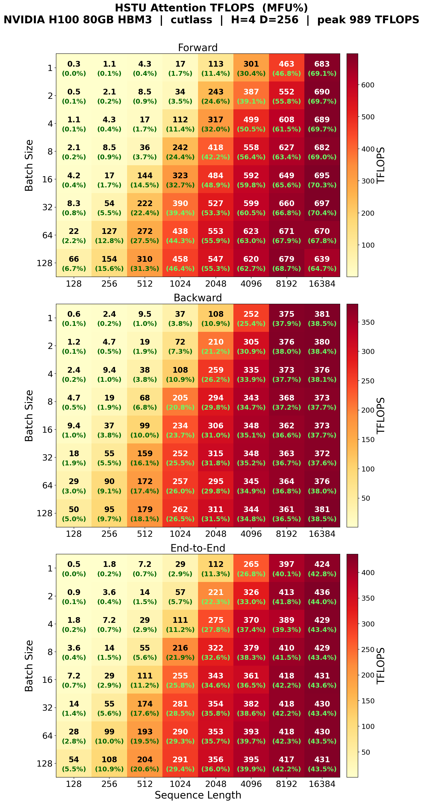
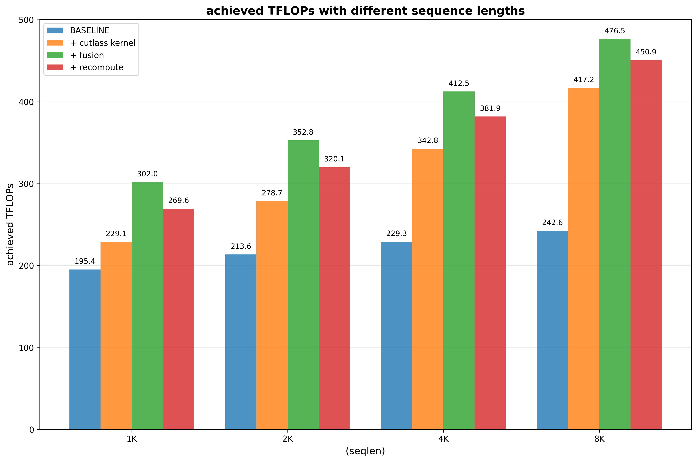
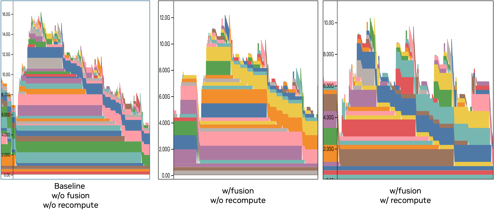

# HSTU Training Benchmark

Three benchmarks are available. They share a single unified
launch/submission pipeline — every script under `scripts/` accepts
`--benchmark-type={e2e,hstu-layer,hstu-attn-kernel}` and dispatches to the
appropriate Python entry.

## Benchmark matrix

| `--benchmark-type` | Python entry | Default experiment list | Shape |
|--------------------|--------------|--------------------------|-------|
| `e2e`              | `training/pretrain_gr_ranking.py` (distributed)     | `experiments.txt`        | Multi-node (default 2×8 GPUs) |
| `hstu-layer`       | `scripts/hstu_layer_benchmark.py`                   | `layer_experiments.txt`  | Single GPU |
| `hstu-attn-kernel` | `scripts/hstu_attn_kernel_benchmark.py`             | `kernel_experiments.txt` | Single GPU |

## Entry points

| Script | Role |
|--------|------|
| `scripts/run_single_experiment_local.sh` | Run **one** config locally (takes `<exp_name> --exp-args=...`) |
| `scripts/run_all_experiments_local.sh`   | Run **all** configs from an experiment list locally |
| `scripts/slurm_job.sub`                  | SLURM job script for **one** config (invoked by submit_all) |
| `scripts/submit_all_experiments_slurm.sh`| Submit **all** configs in an experiment list to SLURM |

Each script accepts `--benchmark-type=<type>` and defaults to `e2e`. All
three user-facing scripts (`run_single_experiment_local.sh`,
`run_all_experiments_local.sh`, `submit_all_experiments_slurm.sh`) support
`--help` and `--dry-run`. `slurm_job.sub` is the internal per-job SLURM
script invoked by `sbatch` — not meant for direct user invocation.

For **SLURM submission**, use `scripts/submit_all_experiments_slurm.sh`
directly; see that script's `--help` for all options.

> **Note**: `--wait-and-analyze` auto-generates `comparison.png` for **e2e
> only** (the analyzer parses the `achieved FLOPS … MFU …%` pattern emitted
> by the training loop). For `hstu-layer` and `hstu-attn-kernel`, the
> per-config logs + artifacts under `results/<ts>/<exp>/` are the source
> of truth; no aggregate plot is generated.

## Experiment list format

All three lists share `exp_name,<args>` per line (comments start with `#`).
`<args>` is benchmark-type-specific:

- `e2e`              : gin options for `generate_gin_config.py`
- `hstu-layer`       : CLI args for `hstu_layer_benchmark.py run`
- `hstu-attn-kernel` : CLI args for `hstu_attn_kernel_benchmark.py`

## Quick commands

```bash
cd recsys-examples/examples/hstu

# E2E: local (single node 8 GPUs)
bash training/benchmark/scripts/run_all_experiments_local.sh \
    --benchmark-type=e2e --exp-file=training/benchmark/experiments.txt

# E2E: SLURM
bash training/benchmark/scripts/submit_all_experiments_slurm.sh \
    --benchmark-type=e2e --container-image=<image> --wait-and-analyze -y

# HSTU layer: local sweep (uses layer_experiments.txt by default)
bash training/benchmark/scripts/run_hstu_layer_benchmark.sh
#   (equivalent to)
bash training/benchmark/scripts/run_all_experiments_local.sh --benchmark-type=hstu-layer

# HSTU layer: SLURM
bash training/benchmark/scripts/submit_all_experiments_slurm.sh \
    --benchmark-type=hstu-layer --container-image=<image> -y

# HSTU attention kernel: local sweep (uses kernel_experiments.txt by default)
bash training/benchmark/scripts/run_hstu_attn_kernel_benchmark.sh

# HSTU attention kernel: SLURM
bash training/benchmark/scripts/submit_all_experiments_slurm.sh \
    --benchmark-type=hstu-attn-kernel --container-image=<image> -y
```

The `run_hstu_layer_benchmark.sh` and `run_hstu_attn_kernel_benchmark.sh`
wrappers are thin shortcuts that delegate to `run_all_experiments_local.sh`
with the right `--benchmark-type`.

## Benchmarks

### End-to-End Training Performance

Progressive benchmark measuring end-to-end MFU as optimizations are incrementally enabled (workload-balanced shuffler, CUTLASS attention, DynamicEmb caching, hash-roundrobin sharding, and prefetch pipeline).

See the [E2E benchmark documentation](./E2E_BENCHMARK.md) for the latest results and the [performance analysis](./PERF_ANALYSIS.md) for the GPU time breakdown.

### HSTU Attention Kernel Benchmark

Standalone benchmark for the **CUTLASS-based HSTU attention kernel**. Sweeps batch sizes and sequence lengths on non-jagged (full-length) inputs and outputs TFLOPS/MFU heatmaps as PNG files.

Configs live in [`kernel_experiments.txt`](./kernel_experiments.txt) — each line is one `(exp_name, CLI args)` pair consumed by the unified launcher.

```bash
cd recsys-examples/examples/hstu

# Local sweep (reads kernel_experiments.txt)
bash training/benchmark/scripts/run_hstu_attn_kernel_benchmark.sh

# SLURM sweep
bash training/benchmark/scripts/submit_all_experiments_slurm.sh \
    --benchmark-type=hstu-attn-kernel --container-image=<image> -y

# Ad-hoc one-off (bypass the config file)
python training/benchmark/scripts/hstu_attn_kernel_benchmark.py \
    --gin-config-file training/configs/benchmark_ranking.gin \
    --batch-sizes 1,2,4,8,16,32,64,128 \
    --seqlens 128,256,512,1024,2048,4096,8192,16384
```

#### Results (single H100-SXM5-80GB)

<p align="center"></p>

MFU uses the dense BF16 Tensor Core peak of 989 TFLOPS per H100 GPU.

| Phase | Best config | Time | TFLOPS | MFU |
|-------|-------------|-----:|-------:|----:|
| Forward | BS=32, SeqLen=16384 | 25.256 ms | 696.6 | 70.4% |
| Backward | BS=128, SeqLen=16384 | 462.121 ms | 380.7 | 38.5% |
| Forward+Backward | BS=2, SeqLen=16384 | 8.834 ms | 435.6 | 44.0% |

The CUTLASS attention kernel reaches peak MFU at large sequence lengths, where the GPU compute units are fully saturated.

### Fused HSTU Layer Benchmark

Single HSTU layer micro-benchmark covering attention kernels, kernel fusions, and selective recompute. Prints `[train_fwd] / [bwd] / [e2e]` TFLOPS lines per configuration.

The baseline is [Meta's open source HSTU implementation](https://github.com/meta-recsys/generative-recommenders/tree/bb389f9539b054e7268528efcd35457a6ad52439): Triton attention, no kernel fusions, no recompute.

Configs live in [`layer_experiments.txt`](./layer_experiments.txt) — each line runs the progressive stage (baseline → +cutlass → +fused → +recompute).

Key arguments to `hstu_layer_benchmark.py` (used inside each config line):

| Argument | Values | Description |
|----------|--------|-------------|
| `--layer-type` | `native` / `fused` / `debug` | HSTU layer implementation |
| `--kernel-backend` | `triton` / `cutlass` | Attention backend (native only) |
| `--fuse-norm-mul-dropout` | `True` / `False` | LayerNorm + Mul + Dropout fusion (native only) |
| `--recompute-input-silu` | `True` / `False` | SiLU activation recompute |
| `--recompute-input-layernorm` | `True` / `False` | LayerNorm activation recompute |
| `--profile` | `True` / `False` | Emit NVTX markers for nsys (default: False) |

```bash
cd recsys-examples/examples/hstu

# Local sweep (reads layer_experiments.txt)
bash training/benchmark/scripts/run_hstu_layer_benchmark.sh

# SLURM sweep
bash training/benchmark/scripts/submit_all_experiments_slurm.sh \
    --benchmark-type=hstu-layer --container-image=<image> -y

# Ad-hoc one-off (bypass config file) — fused layer
python training/benchmark/scripts/hstu_layer_benchmark.py run \
    --iters 100 --warmup-iters 50 \
    --layer-type fused --kernel-backend cutlass \
    --dim-per-head 256 --num-heads 4 --num-layers 1 \
    --dtype bfloat16 --max-seqlen 1024 --full-sequence True --batchsize 32
```

Each run also produces a memory snapshot file. Visualize it with [PyTorch memory tools](https://docs.pytorch.org/docs/stable/torch_cuda_memory.html).

#### Analyzing run results: `analyze_layer_results.py`

After the sweep finishes, run the analyzer against the batch directory
to emit per-exp metrics + two figures (progressive TFLOPS bars + step
time breakdown):

```bash
python training/benchmark/scripts/analyze_layer_results.py \
    training/benchmark/results/<batch_timestamp>
# →  layer_tflops.png           — grouped bars + e2e MFU line
# →  layer_time_breakdown.png   — stacked fwd+bwd + true e2e tick
```

Regex captures MFU from the log lines; older logs without MFU auto-fall
back to a speedup × line.

#### Nsys profiling + sunburst: `--nsys --post-nsys-analyze`

For per-phase GPU time breakdown of a single step, pass `--nsys` at the
launch level. The dispatcher wraps the Python benchmark with
`nsys profile -c cudaProfilerApi ...` and automatically injects
`--profile True` into the benchmark args so the NVTX markers and
`torch.cuda.profiler.start/stop` fire. `--post-nsys-analyze` then
exports the `.nsys-rep` to sqlite and builds a sunburst chart showing
the time breakdown of the **median steady-state step**.

```bash
cd recsys-examples/examples/hstu

# Single config + nsys + auto-sunburst (local)
bash training/benchmark/scripts/run_single_experiment_local.sh plus_fused \
    --benchmark-type=hstu-layer \
    --exp-args="--layer-type fused --kernel-backend cutlass \
        --dim-per-head 256 --num-heads 4 --num-layers 1 \
        --max-seqlen 4096 --batchsize 32 --full-sequence True \
        --dtype bfloat16 --dump-memory-snapshot False \
        --iters 20 --warmup-iters 10 --profiler-start 5 --profiler-end 19" \
    --nsys --post-nsys-analyze

# Full sweep + nsys + auto-sunburst (local, one sunburst per exp)
bash training/benchmark/scripts/run_all_experiments_local.sh \
    --benchmark-type=hstu-layer --nsys --post-nsys-analyze

# Full sweep + nsys + auto-sunburst (SLURM)
bash training/benchmark/scripts/submit_all_experiments_slurm.sh \
    --benchmark-type=hstu-layer --container-image=<image> \
    --nsys --post-nsys-analyze -y
```

**Outputs per exp** (landing in `results/<batch>/<exp>/`):
- `<exp>_*.nsys-rep` — raw nsys capture (profile_start..profile_end window)
- `<exp>_*.sqlite`   — nsys sqlite export (analyzer input)
- `<exp>_*_sunburst.html` — interactive Plotly sunburst (hover for ms / %)
- `<exp>_*_sunburst.png`  — static matplotlib nested pie (fallback)

**Prerequisites**
- `nsys` available in the benchmark container (standard CUDA install provides it)
- `plotly` for the interactive HTML (optional — analyzer gracefully falls back to matplotlib-only if plotly is missing)
- `matplotlib` for the PNG (already required by `analyze_layer_results.py`)

**What's shown in the sunburst**
- **Center** = `e2e step = GPU wall-clock of median step (first kernel start → last kernel end, including GPU idle gaps)`
- **Ring 1** = `fwd` / `bwd` / `idle`
  - `idle` = wall-clock − union of kernel intervals (true GPU-idle gap, e.g. autograd graph overhead)
- **Ring 2** = 4 fwd phases + 4 bwd phases from `fused_hstu_op.py`'s inner NVTX markers: `ln+linear_bias+silu`, `attn`, `norm mul dropout`, `linear_residual`

The median step is selected by **GPU wall-clock** across all captured iters — values on the sunburst come from one coherent real step, not an aggregate.

**Standalone sunburst from an existing `.nsys-rep`**

```bash
nsys export --type sqlite --output X.sqlite --force-overwrite true X.nsys-rep
python training/benchmark/scripts/build_layer_sunburst.py X.sqlite \
    --output X_sunburst.html --png X_sunburst.png --label "my exp"
```

#### Results (single H100-SXM5-80GB)

Sequence lengths 1K–8K, batchsize=32, dim_per_head=256, num_heads=4, embedding_dim=1024.

**Throughput** (columns are incrementally applied):



**Peak memory** (3 HSTU layers, seqlen=4K):



### Memory Estimation

CPU-only script that estimates parameter, activation, and optimizer memory. Supports two modes:

```bash
# From gin config (batch_size, max_seq_len, etc. are read from the config)
python ./training/benchmark/scripts/estimate_memory.py \
    --gin_config training/configs/benchmark_ranking.gin

# From command-line arguments (no gin file needed)
python ./training/benchmark/scripts/estimate_memory.py \
    --batch_size 32 --max_seq_len 4096 --hidden_size 1024 --num_layers 8
```
